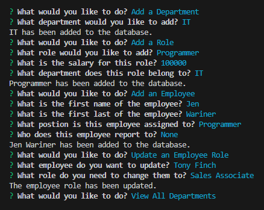

# Employee Tracker

## Description 
Command line application that takes in user inputs for an employee database. User can view departments, roles, and employees. User can also add a department, add a role, add an employee, and update an employee role.

## Table of Contents
1. [Installation](#installation)
2. [Usage](#usage)
3. [Contributing](#contributing)
4. [Tests](#tests)
5. [License](#license)
6. [Questions](#questions)

## Installation
Clone the repo to your local machine, then open the directory in your terminal. Run npm install to download inquirer and mysql.

## Usage
Open the terminal, in the command line type - node index.js - follow the prompts to navigate the database, or add information to the database. 
  
Once you have selected a prompt, you will either view a table or be prompted for information you would like to add/update. 
  
For an example of the process, please view this video: [Demo Video](https://drive.google.com/file/d/10T5PHfaSi9HGPdyHfeR32X_2rbSh6dzA/view)

## Contributing
N/A

## Tests
N/A

## License
Licensed under the [MIT license](https://opensource.org/license/mit/)

## Questions
You can view my GitHub repository here: [JenWariner19/employee-tracker](https://github.com/JenWariner19/employee-tracker) 
If you have any questions and would like to contact me, you can email me at: [jenniferwariner@yahoo.com](mailto:jenniferwariner@yahoo.com)